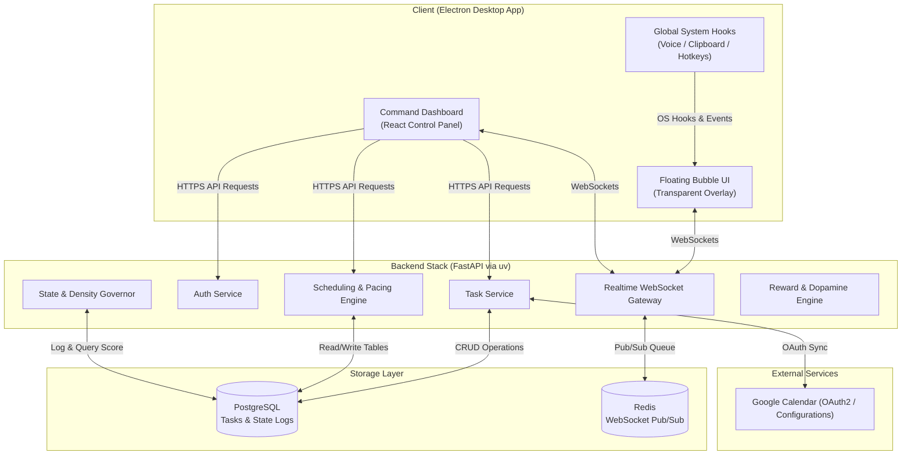
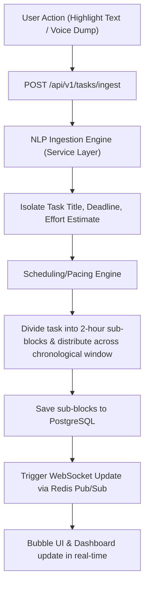
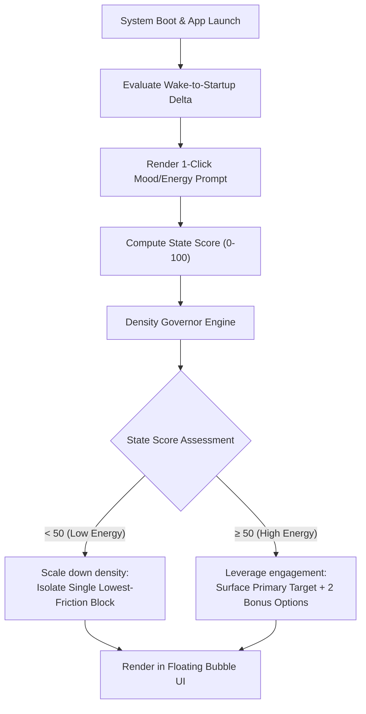
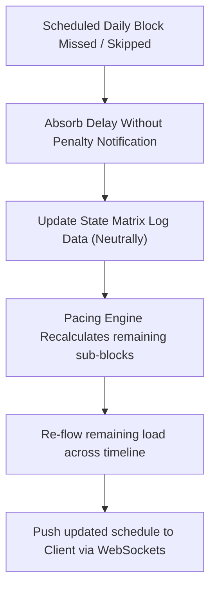
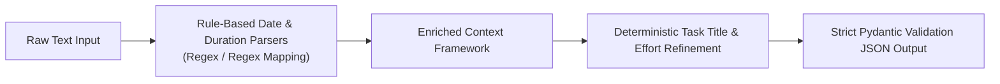

# dopaPal 🧠✨

### The Ambient Cognitive Translation Layer for the ADHD Brain

dopaPal is an omnipresent, non-intrusive cognitive companion designed to align rigid work and study environments with the Interest-Based Nervous System. Instead of forcing neurodivergent users into linear, high-friction productivity workflows that fuel task paralysis and decision fatigue, dopaPal functions as an invisible, supportive secretary. It silently captures chaos via low-friction input vectors, algorithmically slices overwhelming projects into daily blocks, and paces execution based on real-time cognitive energy.

---

## 📖 Table of Contents
1. [Core Philosophy & Design Rules](#-core-philosophy--design-rules)
2. [System Architecture](#-system-architecture)
3. [Comprehensive Feature Set](#-comprehensive-feature-set)
4. [Data Model](#-data-model)
5. [Core Runtime Workflows](#-core-runtime-workflows)
6. [AI & NLP Module Blueprint](#-ai--nlp-module-blueprint)
7. [PINCH Priority & Scoring Engine](#-pinch-priority--scoring-engine)
8. [Tech Stack Matrix](#-tech-stack-matrix)
9. [Project Directory Layout](#-project-directory-layout)
10. [Environment Configuration](#-environment-configuration)
11. [Getting Started & Local Setup](#-getting-started--local-setup)
12. [4-Day Team Implementation Plan](#-4-day-team-implementation-plan)
13. [API Contract Specifications](#-api-contract-specifications)
14. [Demo Script & Presentation Guide](#-demo-script--presentation-guide)

---

## 🎯 Core Philosophy & Design Rules

Standard productivity tools fail the neurodivergent brain by introducing high maintenance overhead, forcing blank-canvas layout building, and weaponizing overdue indicators that trigger avoidant shame spirals. dopaPal handles the organizational burden entirely in the background, governed by three architectural rules:

1. **Energy Scales Depth, Never Visual Density:** High-energy state scores never unlock a wall of tasks. The visual experience remains strictly bounded to *one* immediate execution target. On high-energy days, the system scales the complexity of the micro-step or unlocks up to two optional, highly novel secondary targets to leverage hyperfocus channels safely.
2. **Elimination of Blank-Canvas Paralysis:** The system never interrupts the user with empty text-input frames. When the task pool runs low, dopaPal leverages its background extraction pool (calendar events, passively noticed mentions) to present single-tap, pre-parsed verification chips.
3. **PINCH-Driven Selection Over Urgency Sorting:** Sorting strictly by timeline proximity weaponizes anxiety. dopaPal blends deadline urgency with **PINCH** signals (**P**assion, **I**nterest, **N**ovelty, **C**hallenge, **H**urry) to ensure the next task surfaced is the most engageable, not just the most stressful.

---

## 🏗️ System Architecture

dopaPal uses a desktop runtime client to register system-level interactions and display an unfenced, ambient UI overlay, connected asynchronously to a containerized backend execution stack.



---

## ⚡ Comprehensive Feature Set

### 1. Zero-Friction Task Intake
* **API Integration:** Live, asynchronous OAuth synchronization loops pull deadlines and ticket allocations from Google Calendar, ensuring the user never manually inputs baseline schedules.
* **OS-Level Highlight-to-Task:** A global system hook intercepts user text selections across any application (e.g., Slack threads, local study PDFs, browser windows). Executing the macro registers the snippet directly to the NLP ingestion layer.
* **Speech-to-Task Brain Dumping:** A global hotkey instantiates a microphone audio pipeline, allowing chaotic, verbal thought streams to be transcribed and structured into action items programmatically.

### 2. Time-Blindness Solution (Auto-Slicing)
* **Algorithmic Chunking:** Complex, abstract goals are processed and atomized into single-sitting working increments (defaulting to 2-hour boundaries).
* **Duration-Deadline Pacing:** To prevent deadline-procrastination traps, sub-blocks are distributed across the entire chronological window rather than clustered at the target cutoff. A project requiring four blocks due in a month will be drip-fed weekly or bi-weekly.

### 3. State-Aware Initialization (The Morning Brain)
* **Boot Sequence Analysis:** Measures the wake-to-startup delta to identify periods of early-morning scrolling or task avoidance.
* **Frictionless Energy Matrix:** A single-click mood/energy prompt inside the bubble UI captures immediate availability, prompting optionally for low-state context to scale down ambient density.
* **Focus Mode Toggle:** Acts as an internal application buffer, dampening high-distraction vectors during critical startup windows to preserve execution momentum.

### 4. Dopamine-Aligned Reward Engine
* **Tactile Audio-Visual Feedback:** Completion events trigger satisfying, highly responsive, and variable micro-animations paired with high-quality sound responses (e.g., tactile mechanical switch clicks).
* **Micro-Customizations:** Accumulating completed task blocks unlocks aesthetic upgrades for the overlay and dashboard, providing visual novelty (such as custom accent colors—including a solid `#27dddf` cyan skin).
* **The Interest Vault:** Periodically matches task completions with curated high-quality resources or fascinating facts mapped to the user’s designated interest tags (e.g., cybersecurity networks, German syntax, AI architectures) to satisfy immediate intellectual curiosity.

---

## 📊 Data Model

```sql
-- Core PostgreSQL Relational Schema
CREATE TABLE users (
    id SERIAL PRIMARY KEY,
    email VARCHAR(255) UNIQUE NOT NULL,
    name VARCHAR(255) NOT NULL,
    wake_time_pref TIME NOT NULL
);

CREATE TABLE tasks (
    id SERIAL PRIMARY KEY,
    user_id INT REFERENCES users(id) ON DELETE CASCADE,
    title VARCHAR(255) NOT NULL,
    raw_source_text TEXT,
    source_type VARCHAR(50) NOT NULL, -- 'manual', 'voice', 'highlight', 'calendar'
    deadline TIMESTAMP NOT NULL,
    estimated_hours FLOAT NOT NULL,
    interest_tag VARCHAR(100),
    status VARCHAR(50) DEFAULT 'pending'
);

CREATE TABLE sub_blocks (
    id SERIAL PRIMARY KEY,
    task_id INT REFERENCES tasks(id) ON DELETE CASCADE,
    sequence INT NOT NULL,
    duration_minutes INT NOT NULL DEFAULT 120,
    scheduled_date DATE NOT NULL,
    status VARCHAR(50) DEFAULT 'pending',
    completed_at TIMESTAMP
);

CREATE TABLE state_logs (
    id SERIAL PRIMARY KEY,
    user_id INT REFERENCES users(id) ON DELETE CASCADE,
    date DATE NOT NULL,
    wake_time TIMESTAMP,
    startup_time TIMESTAMP NOT NULL,
    mood_score INT NOT NULL,
    computed_state_score FLOAT NOT NULL
);

CREATE TABLE rewards (
    id SERIAL PRIMARY KEY,
    user_id INT REFERENCES users(id) ON DELETE CASCADE,
    type VARCHAR(50) NOT NULL, -- 'theme', 'audio', 'interest_drop'
    unlocked_at TIMESTAMP DEFAULT CURRENT_TIMESTAMP,
    metadata JSONB
);

CREATE TABLE integration_tokens (
    id SERIAL PRIMARY KEY,
    user_id INT REFERENCES users(id) ON DELETE CASCADE,
    provider VARCHAR(50) NOT NULL,
    access_token_enc TEXT NOT NULL,
    refresh_token_enc TEXT NOT NULL,
    expires_at TIMESTAMP NOT NULL
);
```

---

## 🔄 Core Runtime Workflows

### 1. Ingestion & Splitting Engine



### 2. Daily Initialization Loop



### 3. Failure-Neutral Postponement Loop



---

## 🤖 AI & NLP Module Blueprint

### 1. Ingestion Pipeline

The server implements a hybrid pipeline for structural reliability. Date, interest, and duration patterns are evaluated via deterministic, rule-based matching libraries to guarantee parsing stability, with extensible local LLM integrations planned for semantic sanitization and task categorization.



### 2. State Scoring Algorithm (Deterministic Reference Python Implementation)

```python
def compute_state_score(startup_delta_mins: int, mood_score: int, completion_rate_48h: float, early_actions: int) -> float:
    # Scale components down to normalized weights
    normalized_delta = max(0.0, 1.0 - (startup_delta_mins / 120.0)) # penalize larger gaps up to 2 hours
    normalized_mood = (mood_score - 1) / 4.0 # Scales 1-5 down to 0.0-1.0
    normalized_actions = min(1.0, early_actions / 3.0) # max output threshold caps at 3 actions
    
    state_score = (
        (0.35 * normalized_delta) +
        (0.30 * normalized_mood) +
        (0.25 * completion_rate_48h) +
        (0.10 * normalized_actions)
    ) * 100.0
    return round(state_score, 2)
```

---

## 🧠 PINCH Priority & Scoring Engine

Standard productivity algorithms rank tasks strictly by deadline proximity (`Hurry`). This layout triggers procrastination-avoidance cycles for ADHD brains. `dopaPal` ranks tasks based on their **engageability** using the Interest-Based Nervous System framework:

- **P**assion: Tasks aligned with long-term personal projects or hobbies.
- **I**nterest: Curiosity-driven tasks tagged by the user.
- **N**ovelty: Recently added tasks or custom visual themes.
- **C**hallenge: Intricate problems that trigger hyperfocus.
- **H**urry: Real chronological urgency (deadlines).

The priority equation matches user energy states with the **PINCH** framework:

$$\text{Selection Priority Score} = (\text{Urgency Weight} \times 0.6) + (\text{Novelty Flag} \times 0.2) + (\text{Challenge Match} \times 0.2)$$

On low-energy days, the weights dynamically shift to prioritize low-friction, high-interest tasks to bypass execution paralysis.

---

## 🛠️ Tech Stack Matrix

| Component | Technical Selection | Implementation Reasoning |
| --- | --- | --- |
| **Project & Env Manager** | Astral `uv` | Fast package installs, python interpreter management, locking, and unified script running. |
| **Client Core Shell** | Electron + electron-vite + React | Enables cross-platform OS desktop boundaries, global system hotkeys, and borderless transparent rendering layouts. |
| **State Management** | Zustand / React Query | Lightweight client cache memory architecture; maps clean async client subscriptions to WebSockets. |
| **Transcription Layer** | Web Speech API | Standardized native Chromium engine abstraction. Zero host-server invocation overhead or latency during live demo operations. |
| **Backend Framework** | FastAPI (Python 3.14) | Native async runtime architectures designed directly for data-intensive I/O routing and streaming WebSocket lifecycles. |
| **Database & Cache** | PostgreSQL + Redis | ACID relational validation tracking tasks and nested sub-blocks seamlessly alongside low-latency WebSocket pub/sub queues. |
| **Deterministic Parsing** | `dateparser` + Python Regex | Insulates application timelines from LLM hallucinations or parsing syntax errors. |

---

## 📂 Project Directory Layout

```text
dopapal/
├── client/                 # Electron Desktop Application
│   ├── src/
│   │   ├── main/           # Electron main process (system hooks, window managers)
│   │   └── renderer/       # React dashboard & transparent overlay views
│   │       ├── assets/     # Sounds (mechanical clicks), tray/bubble icons
│   │       ├── components/ # Bubble overlay UI, Command Dashboard macro map
│   │       ├── context/    # Global configuration states & user sessions
│   │       ├── hooks/      # WebSockets, React Query hooks
│   │       └── styles/     # Accent visual styles and customizations
│   └── package.json
├── server/                 # FastAPI Backend Stack
│   ├── app/
│   │   ├── api/            # Route controllers (auth, tasks, states, rewards, integrations)
│   │   ├── core/           # Config, database setup, JWT auth
│   │   ├── models/         # SQLAlchemy schemas (PostgreSQL)
│   │   ├── services/       # Six core engines, external API connections
│   │   │   └── ai/         # AI models processing, parser prompt wrappers
│   │   └── main.py         # Application entry point & lifespan handler
│   ├── migrations/         # Alembic database migrations
│   ├── requirements.txt    # Legacy backend dependency registry
│   └── Dockerfile          # Optimized uv multi-stage container configuration
├── .dockerignore           # Excluded files list for Docker context builds
├── .gitignore              # Standard git exclusion registry
├── .python-version         # Pin python virtual runtime configuration (3.14)
├── pyproject.toml          # Astral uv project declarations
├── uv.lock                 # Autogenerated uv dependencies lock
├── run.bat                 # Windows CMD docker start up utility script
├── run.ps1                 # Windows PowerShell docker launcher with logging
├── .env.example            # Environment variables configuration template
└── README.md
```

---

## ⚙️ Environment Configuration

Copy the template below to create your local `.env` configuration in the root directory:

```ini
# --- Database & Cache ---
DATABASE_URL=postgresql://dopapal_user:dopapal_password@db:5432/dopapal_db
REDIS_URL=redis://redis:6379/0

# --- Security ---
SECRET_KEY=supersecretjwtkeyforauthenticatingclients
ALGORITHM=HS256
ACCESS_TOKEN_EXPIRE_MINUTES=1440

# --- Third-Party Integrations ---
GOOGLE_CLIENT_ID=google-oauth-client-id.apps.googleusercontent.com
GOOGLE_CLIENT_SECRET=google-oauth-client-secret
```

---

## 🚀 Getting Started & Local Setup

### 📋 Prerequisites
- **Node.js** (v18+) & **npm**
- **Astral `uv`** (Python package installer)
- **PostgreSQL** & **Redis**

### 💻 Local Setup Instructions

#### 1. Setup Backend Stack (using `uv`)
1. Sync and build the python environment:
   ```bash
   uv sync
   ```
2. Start the local developer server:
   ```bash
   uv run dopapal
   ```
   *The FastAPI server will be active at `http://localhost:8000` with Swagger docs available at `http://localhost:8000/docs`.*

#### 2. Run with Docker Compose
If you have Docker Desktop installed, you can launch the backend, postgres, and redis services together in background mode, automatically streaming backend logs:
- **On PowerShell**:
  ```powershell
  .\run.ps1
  ```
- **On CMD**:
  ```cmd
  run.bat
  ```
- **Stopping containers**:
  ```bash
  docker-compose down
  ```

#### 3. Setup Frontend Client (Electron)
1. Navigate to the client directory:
   ```bash
   cd client
   ```
2. Install Node dependencies:
   ```bash
   npm install
   ```
3. Run the Electron development server:
   ```bash
   npm run dev
   ```

---

## 📅 4-Day Team Implementation Plan

### Day 1: System Baseline & Base Handshakes

* **Backend Developer 1 (BE1):** Instantiate PostgreSQL containerized database definitions, manage baseline migrations via Alembic, construct the core FastAPI app routing system, and setup Google OAuth integrations.
* **Backend Developer 2 (BE2):** Construct real-time communication bridges via Redis Pub/Sub channels alongside internal state engine endpoints.
* **Frontend UI 1 (FE1):** Scaffold the Electron shell runtime environment; configure explicit transparent overlays and assert global hotkey listeners.
* **Frontend UI 2 (FE2):** Bootstrap the core Control Panel interface, structuring state routing containers and establishing base visual layouts.
* **AI/NLP Engineer (AI):** Build out the prompt template matrix on local Ollama processes; enforce absolute strict validation schemas using structural output formatting.

### Day 2: Ingestion Pipelines & Core Business Logic

* **BE1:** Finalize the main structural ingest path and integrate calendar sync engines.
* **BE2:** Code the core Scheduling Engine logic that consumes the AI module's chunking bounds, and implement the daily state score equation.
* **FE1:** Bind native OS clipboard capture workflows and audio input processing streams straight to the API injection endpoints.
* **FE2:** Complete the interactive Task Map tracking dashboard layout, linking execution sliders to target pacing update paths.
* **AI:** Package parsing modules cleanly for service ingestion, and implement deterministic task chunking boundary rules.

### Day 3: Real-Time Synchronization & UX Enhancements

* **BE1:** Build out the Reward Service tracking frameworks and write seeding scripts for demo state profiles.
* **BE2:** Wire end-to-end WebSocket updates ensuring live data mutations on the backend push straight to the client layers.
* **FE1:** Build out the central single-focus card view layout inside the floating overlay, complete with micro-interaction animation effects.
* **FE2:** Construct multi-theme visual states, map interactive drag-and-drop overrides, and layer reward badges into the control engine dashboard.
* **AI:** Refine extraction pipelines against complex text patterns and load structural static content frameworks for the Interest Vault library.

### Day 4: Integration Testing, Calibration & Rehearsals

* **All Team Assets:** Perform end-to-end testing (Highlight/Voice Capture $\rightarrow$ Ingestion Processing $\rightarrow$ Task Sub-division $\rightarrow$ Floating Card Notification $\rightarrow$ Checked-off Action $\rightarrow$ Reward Distribution). Calibrate scoring system metrics, secure clean state baselines, shoot fallback demonstration capture footage, and lock down presentation timing scripts.

---

## 📝 API Contract Specifications

### 1. Ingest Task Payload

* **Endpoint:** `POST /api/v1/tasks/ingest`
* **Content Type:** `application/json`

```json
// Request Payload
{
  "source_text": "Need to complete the system specification document by next Friday night, should take about 6 hours total.",
  "source_type": "highlight"
}

// Response (201 Created)
{
  "id": 142,
  "title": "Complete system specification document",
  "deadline": "2026-06-26T23:59:59Z",
  "estimated_hours": 6.0,
  "interest_tag": "architecture",
  "sub_blocks": [
    { "sequence": 1, "duration_minutes": 120, "scheduled_date": "2026-06-19" },
    { "sequence": 2, "duration_minutes": 120, "scheduled_date": "2026-06-22" },
    { "sequence": 3, "duration_minutes": 120, "scheduled_date": "2026-06-24" }
  ]
}
```

### 2. Live State Retrieval

* **Endpoint:** `GET /api/v1/bubble/next`
* **Authorization:** `Bearer <JWT_TOKEN>`

```json
// Response (200 OK)
{
  "state_score": 74.5,
  "mode": "focused",
  "primary_block": {
    "sub_block_id": 801,
    "task_title": "Write backend database schemas",
    "duration_minutes": 120,
    "context_hint": "Open the Postgres schema blueprint file"
  },
  "bonus_blocks": [
    {
      "sub_block_id": 892,
      "task_title": "Refactor German vocabulary array definitions",
      "duration_minutes": 45
    }
  ]
}
```

---

## 🎤 Demo Script & Presentation Guide

1. **The Pitch (First 30 Seconds):** Start by addressing the foundational problem: standard productivity software demands high baseline executive functioning just to manage the tool, turning organization into a source of distraction and task avoidance. Introduce `dopaPal` as an ambient, invisible secretary that tracks obligations without creating visual noise or introducing administrative friction.
2. **Frictionless Ingestion Presentation:** Highlight unstructured text directly within a random application window (like a simulated chaotic email exchange). Execute your global key combination and show how the floating bubble intercepts the selection, uses local NLP models to parse the criteria, and logs the sub-divided steps silently behind the scenes without pulling the user away from their current workspace.
3. **State Calibration Display:** Demonstrate the morning boot cycle sequence. Tap a low-energy state score value and show how the overlay interface gracefully adjusts, reducing density boundaries down to a single, actionable micro-step (e.g., *"Open the text document"*).
4. **Real-Time Dashboard Synced Overrides:** Open the main system Command Dashboard. Modify a project timeline via the interactive pacing slider. Highlight the immediate backend recalculation as the updated daily block requirements update live inside the floating bubble interface via WebSocket pushes.
5. **Closing Architectural Summary:** Reiterate the core technical principle: zero red overdue badges, zero blank-canvas text input forms, and absolute failure-neutral scheduling loops that respect the user's focus and attention limits.