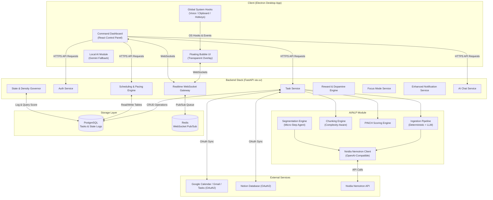
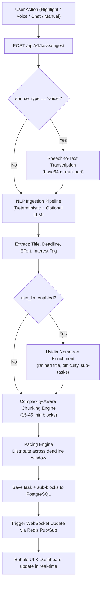
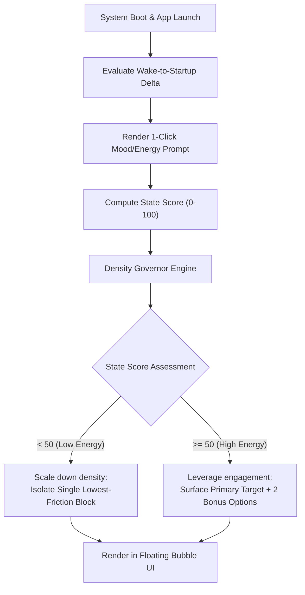
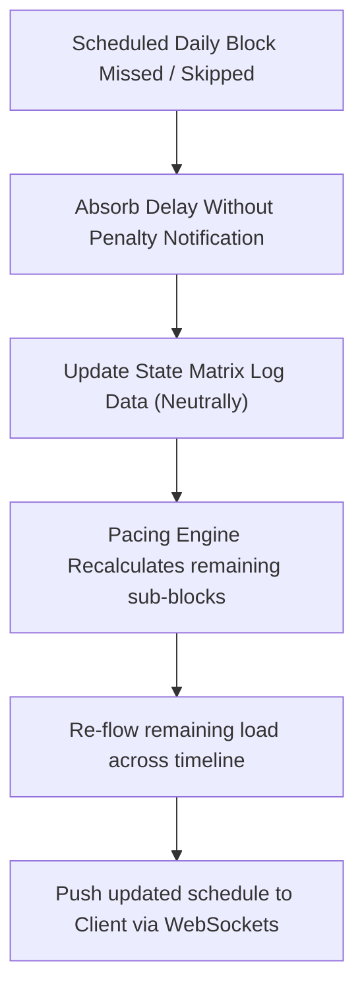
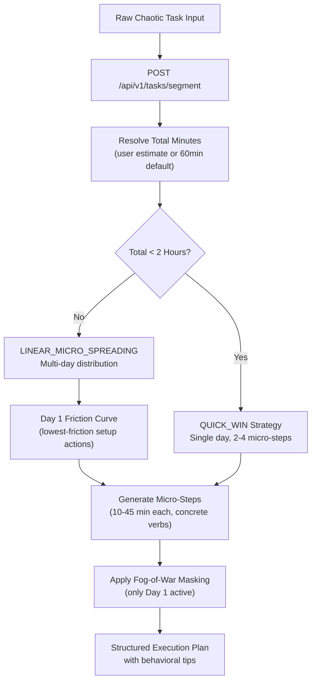
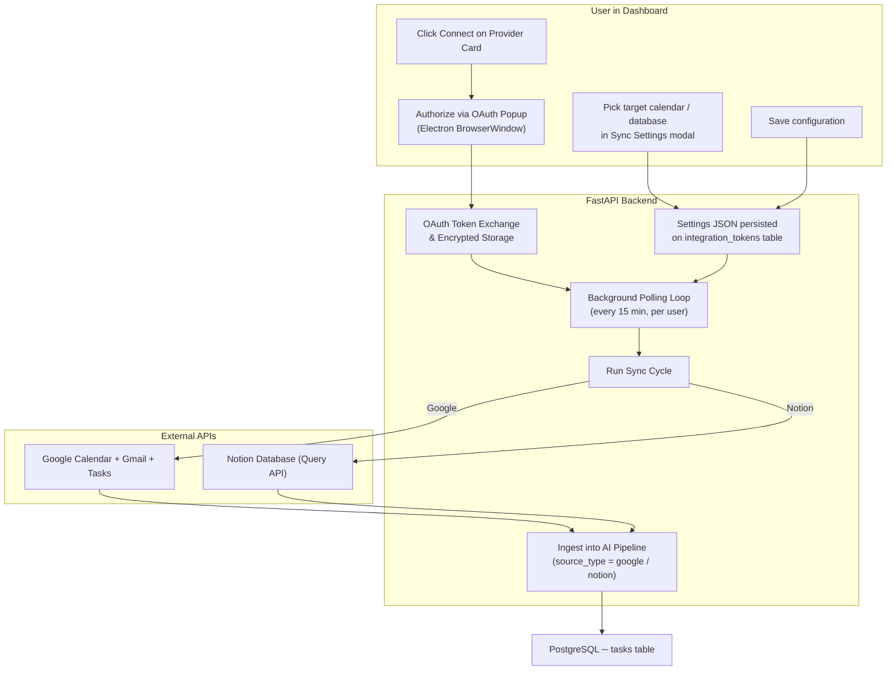
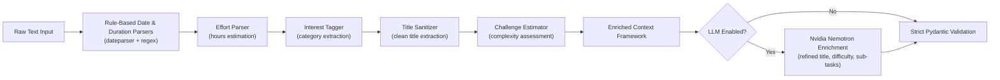

# DopaPal 

### The Ambient Cognitive Translation Layer for the ADHD Brain

dopaPal is an omnipresent, non-intrusive cognitive companion designed to align rigid work and study environments with the Interest-Based Nervous System. Instead of forcing neurodivergent users into linear, high-friction productivity workflows that fuel task paralysis and decision fatigue, dopaPal functions as an invisible, supportive secretary. It silently captures chaos via low-friction input vectors, algorithmically slices overwhelming projects into daily blocks, and paces execution based on real-time cognitive energy.

---

## Current Repository Shape

The active code is split into two maintained workspaces:

```text
dopapal_system/
├── client/                 # Electron + React desktop client
│   ├── src/
│   │   ├── main/           # Electron main process, preload bridge, OS hooks
│   │   │   ├── main.js     # Window management, global shortcuts, IPC handlers
│   │   │   ├── preload.js  # Context bridge for renderer IPC
│   │   │   ├── ai.js       # Client-side Gemini AI extraction (fallback)
│   │   │   ├── db.js       # Local SQLite via better-sqlite3 (offline cache)
│   │   │   └── taskService.js  # Local task persistence helpers
│   │   └── renderer/       # React dashboard, bubble overlay, client API wrapper
│   │       ├── components/
│   │       │   ├── Bubble/      # Floating ambient overlay UI
│   │       │   ├── Dashboard/   # Full command dashboard + Interest Vault
│   │       │   └── Common/      # Shared UI primitives
│   │       ├── contexts/        # LanguageContext for i18n
│   │       ├── services/api.js  # Axios API client for backend
│   │       ├── themes.js        # 5 unlockable visual themes
│   │       ├── locales.js       # Translation strings (11 languages)
│   │       └── App.jsx          # Root React app with router
│   ├── package.json
│   └── vite.config.js
├── server/                 # FastAPI backend project
│   ├── app/
│   │   ├── api/v1/         # Route controllers
│   │   │   ├── tasks.py        # Task CRUD, ingestion, bubble, voice, segment, focus mode, notifications
│   │   │   ├── state.py        # Morning state logging and score computation
│   │   │   ├── users.py        # User settings (name, language, wake time)
│   │   │   ├── rewards.py      # Reward unlocking, Interest Vault, shop purchases
│   │   │   ├── integrations.py # Multi-provider integration config (Google, Notion, Jira, Canvas)
│   │   │   ├── chat.py         # AI assistant chat with auto-task creation
│   │   │   ├── auth_google.py  # Google OAuth2 flow (Calendar, Gmail, Tasks)
│   │   │   ├── auth_notion.py  # Notion OAuth2 flow (Databases)
│   │   │   └── sync.py         # Background sync management (Google + Notion)
│   │   ├── core/
│   │   │   ├── config.py       # Pydantic settings (env-driven)
│   │   │   └── database.py     # SQLAlchemy engine + session
│   │   ├── models/             # SQLAlchemy ORM models
│   │   ├── services/
│   │   │   ├── ai/             # AI/NLP module (see §6)
│   │   │   ├── task_service.py     # Task persistence, scheduling, PINCH ranking
│   │   │   ├── state_service.py    # Morning state score computation
│   │   │   ├── reward_service.py   # Reward engine + Interest Vault
│   │   │   ├── focus_mode.py       # Focus mode toggle + priority adjustment
│   │   │   ├── enhanced_notification.py  # Audio-visual notification system
│   │   │   ├── speech_to_text.py   # Voice transcription service
│   │   │   ├── duration_parser.py  # Natural language duration parsing
│   │   │   ├── google_service.py   # Google Calendar/Gmail/Tasks sync
│   │   │   ├── notion_service.py   # Notion database sync
│   │   │   ├── integration_service.py  # Multi-provider integration management
│   │   │   ├── websocket_manager.py    # Redis pub/sub WebSocket fan-out
│   │   │   ├── logic_engines.py    # Shared business logic helpers
│   │   │   └── constants.py        # Default sync settings
│   │   ├── tests/              # Backend test suite
│   │   └── main.py             # FastAPI app factory + lifespan handler
│   ├── migrations/             # Alembic database migrations
│   ├── scripts/                # Utility scripts
│   ├── secret/                 # Google OAuth client_secret.json
│   ├── pyproject.toml          # Backend Python project metadata (uv)
│   ├── uv.lock                 # Backend dependency lock
│   ├── Dockerfile              # Optimized uv multi-stage container
│   ├── main.py                 # Local uvicorn launcher
│   ├── clear_db.py             # DB reset utility
│   ├── migrate_db.py           # Migration runner
│   └── reset_db.py             # Full DB reset utility
├── docker-compose.yml          # Backend, PostgreSQL, and Redis orchestration
├── .env.example                # Environment variables template
├── run.bat                     # Windows Docker startup script
└── run.sh                      # Shell Docker launcher with logging
```

---

## Table of Contents
1. [Core Philosophy & Design Rules](#-core-philosophy--design-rules)
2. [System Architecture](#-system-architecture)
3. [Comprehensive Feature Set](#-comprehensive-feature-set)
4. [Data Model](#-data-model)
5. [Core Runtime Workflows](#-core-runtime-workflows)
6. [AI & NLP Module Blueprint](#-ai--nlp-module-blueprint)
7. [PINCH Priority & Scoring Engine](#-pinch-priority--scoring-engine)
8. [Tech Stack Matrix](#-tech-stack-matrix)
9. [Project Directory Layout](#-project-directory-layout)
10. [Environment Configuration](#-environment-configuration)
11. [Getting Started & Local Setup](#-getting-started--local-setup)
12. [4-Day Team Implementation Plan](#-4-day-team-implementation-plan)
13. [API Contract Specifications](#-api-contract-specifications)
14. [Demo Script & Presentation Guide](#-demo-script--presentation-guide)

---

## Core Philosophy & Design Rules

Standard productivity tools fail the neurodivergent brain by introducing high maintenance overhead, forcing blank-canvas layout building, and weaponizing overdue indicators that trigger avoidant shame spirals. dopaPal handles the organizational burden entirely in the background, governed by three architectural rules:

1. **Energy Scales Depth, Never Visual Density:** High-energy state scores never unlock a wall of tasks. The visual experience remains strictly bounded to *one* immediate execution target. On high-energy days, the system scales the complexity of the micro-step or unlocks up to two optional, highly novel secondary targets to leverage hyperfocus channels safely.
2. **Elimination of Blank-Canvas Paralysis:** The system never interrupts the user with empty text-input frames. When the task pool runs low, dopaPal leverages its background extraction pool (calendar events, passively noticed mentions) to present single-tap, pre-parsed verification chips.
3. **PINCH-Driven Selection Over Urgency Sorting:** Sorting strictly by timeline proximity weaponizes anxiety. dopaPal blends deadline urgency with **PINCH** signals (**P**assion, **I**nterest, **N**ovelty, **C**hallenge, **H**urry) to ensure the next task surfaced is the most engageable, not just the most stressful.

---

## System Architecture

dopaPal uses a desktop runtime client to register system-level interactions and display an unfenced, ambient UI overlay, connected asynchronously to a containerized backend execution stack.



---

## Comprehensive Feature Set

### 1. Zero-Friction Task Intake
* **API Integration:** Live, asynchronous OAuth synchronization loops pull deadlines and ticket allocations from Google Calendar, Gmail, and Google Tasks, ensuring the user never manually inputs baseline schedules.
* **OS-Level Highlight-to-Task:** A global system hook (`Ctrl+Shift+Space`) intercepts user text selections across any application (e.g., Slack threads, local study PDFs, browser windows). Executing the macro registers the snippet directly to the NLP ingestion layer.
* **Speech-to-Task Brain Dumping:** A global hotkey instantiates a microphone audio pipeline, allowing chaotic, verbal thought streams to be transcribed and structured into action items programmatically. Supports both base64-encoded payloads and streaming multipart file uploads.
* **AI Smart Input:** Natural language text input parsed through the NLP pipeline via the Bubble UI or Dashboard.
* **Manual Task Entry:** Structured form with title, duration (natural language parsing), due date, and priority auto-calculation.
* **AI Chat Assistant:** Conversational AI interface that can understand task descriptions and automatically create tasks via structured JSON output, integrated with the NLP pipeline.

### 2. Time-Blindness Solution (Auto-Slicing)
* **Algorithmic Chunking:** Complex, abstract goals are processed and atomized into single-sitting working increments (15–45 minute blocks based on task complexity).
* **Complexity-Aware Splitting:** The chunking engine analyzes task keywords, interest tags, and source text length to determine optimal sub-block durations — complex tasks get shorter blocks (Pomodoro-style), simpler tasks get longer flows.
* **Duration-Deadline Pacing:** To prevent deadline-procrastination traps, sub-blocks are distributed across the entire chronological window rather than clustered at the target cutoff. A project requiring four blocks due in a month will be drip-fed weekly or bi-weekly.
* **LLM-Powered Sub-Task Generation:** When the Nvidia Nemotron LLM is enabled, the AI generates specific, actionable sub-task titles with appropriate time allocations instead of generic chunking.

### 3. State-Aware Initialization (The Morning Brain)
* **Boot Sequence Analysis:** Measures the wake-to-startup delta to identify periods of early-morning scrolling or task avoidance.
* **Frictionless Energy Matrix:** A single-click mood/energy prompt inside the bubble UI captures immediate availability, prompting optionally for low-state context to scale down ambient density.
* **Focus Mode Toggle:** Acts as an internal application buffer, dampening high-distraction vectors during critical startup windows to preserve execution momentum. Adjustable priority multiplier during focus sessions.

### 4. Dopamine-Aligned Reward Engine
* **Tactile Audio-Visual Feedback:** Completion events trigger satisfying, highly responsive, and variable micro-animations paired with high-quality sound responses (e.g., tactile mechanical switch clicks).
* **Micro-Customizations:** Accumulating completed task blocks unlocks aesthetic upgrades for the overlay and dashboard, providing visual novelty (such as custom accent colors—including 5 unlockable themes: Default, Ocean Breeze, Sunset Flare, Neon Cyberpunk, Midnight Gold).
* **The Interest Vault:** Periodically matches task completions with curated high-quality resources or fascinating facts mapped to the user's designated interest tags (e.g., cybersecurity networks, German syntax, AI architectures) to satisfy immediate intellectual curiosity.
* **Shop System:** XP-earned currency can purchase music tracks (Lo-fi Focus Loop, Rain Desk), visual treatments (Frosted Panels, Compact Mode), and theme unlocks.

### 5. Play Mode (Single-Focus Sprint)
* **Timed Execution Queue:** Fetches PINCH-ranked tasks and presents them as a sequential sprint queue with adjustable durations per block.
* **Live Countdown:** Real-time countdown timer per block with overtime tracking and XP bonus/penalty calculations.
* **Queue Reordering:** Drag-to-reorder blocks within the sprint queue before starting.
* **Session Summary:** Post-sprint breakdown showing base XP, bonuses, penalties, and net XP earned.

### 6. AI Chat Assistant
* **Conversational Interface:** Natural language chat with an ADHD-optimized AI persona that validates overwhelm and pivots to actionable steps.
* **Auto-Task Creation:** The AI can output structured JSON to automatically ingest tasks into the NLP pipeline without manual entry.
* **Markdown Rendering:** Rich markdown response rendering with headers, bold text, bullet points, and numbered lists.

### 7. Multi-Language Support
* **11 Languages:** Arabic, English, French, Spanish, German, Turkish, Persian, Urdu, Hindi, Japanese, Chinese.
* **RTL Support:** Full right-to-left layout support for Arabic, Persian, and Urdu.
* **Language Context:** React context-based language switching with persistent preferences.

### 8. Theming System
* **5 Unlockable Themes:** Dopa Default (purple), Ocean Breeze (cyan), Sunset Flare (orange), Neon Cyberpunk (pink), Midnight Gold (gold).
* **CSS Custom Properties:** Dynamic theme application via CSS custom properties for accent colors, backgrounds, surfaces, and text colors.
* **XP-Gated Unlocks:** Themes cost XP earned through task completion, providing gamified progression.

---

## Data Model

```sql
-- Core PostgreSQL Relational Schema (SQLAlchemy ORM)
CREATE TABLE users (
    id SERIAL PRIMARY KEY,
    email VARCHAR(255) UNIQUE NOT NULL,
    name VARCHAR(255) NOT NULL,
    language VARCHAR(10) DEFAULT 'en',
    wake_time_pref TIME NOT NULL
);

CREATE TABLE tasks (
    id SERIAL PRIMARY KEY,
    user_id INT REFERENCES users(id) ON DELETE CASCADE,
    title VARCHAR(255) NOT NULL,
    raw_source_text TEXT,
    source_type VARCHAR(50) NOT NULL, -- 'manual', 'voice', 'highlight', 'calendar', 'assistant'
    deadline TIMESTAMP NOT NULL,
    estimated_hours FLOAT NOT NULL,
    interest_tag VARCHAR(100),
    status VARCHAR(50) DEFAULT 'pending',
    created_at TIMESTAMP DEFAULT CURRENT_TIMESTAMP,
    pinch_score FLOAT -- 0-100 priority score from PINCH engine
);

CREATE TABLE sub_blocks (
    id SERIAL PRIMARY KEY,
    task_id INT REFERENCES tasks(id) ON DELETE CASCADE,
    sequence INT NOT NULL,
    title VARCHAR(255), -- Optional descriptive title for the sub-block
    duration_minutes INT NOT NULL DEFAULT 120,
    scheduled_date DATE NOT NULL,
    status VARCHAR(50) DEFAULT 'pending', -- 'pending', 'completed', 'skipped'
    completed_at TIMESTAMP
);

CREATE TABLE state_logs (
    id SERIAL PRIMARY KEY,
    user_id INT REFERENCES users(id) ON DELETE CASCADE,
    date DATE NOT NULL,
    wake_time TIMESTAMP,
    startup_time TIMESTAMP NOT NULL,
    mood_score INT NOT NULL, -- 1-5 scale
    computed_state_score FLOAT NOT NULL -- 0-100 weighted score
);

CREATE TABLE rewards (
    id SERIAL PRIMARY KEY,
    user_id INT REFERENCES users(id) ON DELETE CASCADE,
    type VARCHAR(50) NOT NULL, -- 'theme', 'audio', 'shop_item', 'interest_drop'
    unlocked_at TIMESTAMP DEFAULT CURRENT_TIMESTAMP,
    metadata_json JSONB -- Flexible metadata (item_id, fact, theme details)
);

CREATE TABLE integration_tokens (
    id SERIAL PRIMARY KEY,
    user_id INT REFERENCES users(id) ON DELETE CASCADE,
    provider VARCHAR(50) NOT NULL, -- 'google', 'notion', 'jira', 'canvas'
    access_token_enc TEXT NOT NULL,
    refresh_token_enc TEXT,
    expires_at TIMESTAMP NOT NULL,
    settings_json JSONB -- Provider-specific configs (sync settings, scopes, etc.)
);
```

---

## Core Runtime Workflows

### 1. Ingestion & Splitting Engine



### 2. Daily Initialization Loop



### 3. Failure-Neutral Postponement Loop



### 4. Task Segmentation Agent



### 5. External Integration Sync Pipelines

dopaPal supports two external sync providers — **Google** (Calendar, Gmail, Tasks) and **Notion** (databases). Both follow the same architectural pattern: OAuth-based authentication, a user-facing settings modal for configuration, and a background polling loop that runs every 15 minutes.



#### Google Sync Pipeline

- **OAuth Flow:** `GET /auth/google/url` → user authorises → `GET /auth/google/callback` exchanges code for tokens → encrypted in `integration_tokens`
- **Sync Scope:** Calendar events (title, deadline), Gmail (unread count, subject-line tasks), Google Tasks (existing task lists)
- **Incremental Sync:** Uses `last_synced_at` timestamp to only fetch new/changed items
- **Settings:** Configurable via `PUT /sync/google/settings` — calendar IDs, email filters, sync toggles
- **Error Handling:** Per-item failures are logged and skipped; one bad event never aborts the full sync

#### Notion Sync Pipeline

- **OAuth Flow:** `GET /auth/notion/url` → user authorises → `GET /auth/notion/callback` exchanges code for an access token → encrypted in `integration_tokens`
- **Database Discovery:** After OAuth, the UI calls `GET /sync/notion/databases` to list all databases the integration can access. The user picks one from a dropdown and saves.
- **Property Mapping:** After selecting a database, the UI fetches the database's property schema via `GET /sync/notion/database-schema`. Users pick from actual column names in type-filtered dropdowns (title columns for Title, date columns for Deadline, select/status/multi_select columns for Interest Tag). Falls back to text input if schema is unavailable.
- **Completion Status:** Users can optionally select which column tracks completion (status/select/checkbox). If a `status` or `select` column is chosen, the UI shows the available options in a dropdown for the "completed value". If a checkbox is chosen, checked = done.
- **Completion Filter:** When `ignore_completed` is enabled (default), pages whose configured `status_field` value matches `completed_status_value` (default: "Done") are skipped. If no `status_field` is set, all properties are checked (backwards-compatible).
- **Incremental Sync:** Queries via `last_edited_time` filter — only pages modified since the last sync are fetched
- **Deduplication:** Tracked via `synced_page_ids` in settings JSON to avoid re-ingesting the same page
- **Failure-Neutral:** A page with a missing title or malformed date is logged and skipped; sync continues for all other pages
- **Background Polling:** Same 15-minute interval as Google; status is checked by the client every 20 seconds to detect new syncs

---

## 🤖 AI & NLP Module Blueprint

### 1. Ingestion Pipeline

The server implements a hybrid pipeline for structural reliability. Date, interest, and duration patterns are evaluated via deterministic, rule-based matching libraries to guarantee parsing stability, with extensible Nvidia Nemotron LLM integration for semantic enrichment and task categorization.



### 2. AI Module Architecture

The AI module (`app/services/ai/`) is a pure-logic layer with no SQLAlchemy dependency:

| Component | File | Responsibility |
| --- | --- | --- |
| **AIService** | `service.py` | Single entry point — orchestrates ingest, score, and segment |
| **IngestionPipeline** | `ingestion.py` | Deterministic parsing with optional LLM enrichment |
| **ChunkingEngine** | `chunking.py` | Complexity-aware sub-block splitting (15–45 min) |
| **PinchEngine** | `pinch.py` | PINCH priority scoring with energy-weighted ranking |
| **SegmentationEngine** | `segmentation.py` | Task segmentation agent (Quick Win vs Linear Spreading) |
| **NvidiaClient** | `llm/nvidia_client.py` | OpenAI-compatible Nvidia Nemotron API wrapper |

### 3. Deterministic Parsers

| Parser | File | What it extracts |
| --- | --- | --- |
| **Date Parser** | `parsers/date_parser.py` | Deadline from natural language ("next Friday", "in 3 days") |
| **Effort Parser** | `parsers/effort_parser.py` | Estimated hours ("about 6 hours", "half day") |
| **Interest Tagger** | `parsers/interest_tagger.py` | Category tags ("coding", "health", "finance") |
| **Title Sanitizer** | `parsers/title_sanitizer.py` | Clean, concise task title from chaotic text |
| **Challenge Estimator** | `parsers/challenge_estimator.py` | Complexity score from text analysis |

### 4. LLM Integration (Nvidia Nemotron)

```python
# NvidiaClient uses OpenAI-compatible API
client = OpenAI(
    base_url="https://integrate.api.nvidia.com/v1",
    api_key=NVIDIA_API_KEY,
    timeout=15.0,
)

# Enrichment call (title refinement, difficulty, sub-tasks)
completion = client.chat.completions.create(
    model="nvidia/nemotron-3-super-120b-a12b",
    messages=[{"role": "user", "content": prompt}],
    temperature=1,
    top_p=0.95,
    max_tokens=16384,
    extra_body={
        "chat_template_kwargs": {"enable_thinking": True},
        "reasoning_budget": 16384
    }
)
```

The LLM enrichment is **opt-in** (`AI_USE_LLM=true` in `.env`) and **best-effort** — any failure (timeout, API down, bad JSON) is caught and logged, falling back to deterministic parsing. Task capture never blocks on the LLM.

### 5. State Scoring Algorithm (Deterministic Reference Python Implementation)

```python
def compute_state_score(startup_delta_mins: int, mood_score: int, completion_rate_48h: float, early_actions: int) -> float:
    # Scale components down to normalized weights
    normalized_delta = max(0.0, 1.0 - (startup_delta_mins / 120.0)) # penalize larger gaps up to 2 hours
    normalized_mood = (mood_score - 1) / 4.0 # Scales 1-5 down to 0.0-1.0
    normalized_actions = min(1.0, early_actions / 3.0) # max output threshold caps at 3 actions
    
    state_score = (
        (0.35 * normalized_delta) +
        (0.30 * normalized_mood) +
        (0.25 * completion_rate_48h) +
        (0.10 * normalized_actions)
    ) * 100.0
    return round(state_score, 2)
```

---

## 🧠 PINCH Priority & Scoring Engine

Standard productivity algorithms rank tasks strictly by deadline proximity (`Hurry`). This layout triggers procrastination-avoidance cycles for ADHD brains. `dopaPal` ranks tasks based on their **engageability** using the Interest-Based Nervous System framework:

- **P**assion: Tasks aligned with long-term personal projects or hobbies.
- **I**nterest: Curiosity-driven tasks tagged by the user.
- **N**ovelty: Recently added tasks or custom visual themes.
- **C**hallenge: Intricate problems that trigger hyperfocus.
- **H**urry: Real chronological urgency (deadlines).

The priority equation matches user energy states with the **PINCH** framework:

**High Energy (state_score >= 50):**
$$\text{Selection Priority Score} = (\text{Urgency} \times 0.6) + (\text{Novelty} \times 0.2) + (\text{Challenge} \times 0.2)$$

**Low Energy (state_score < 50):**
$$\text{Selection Priority Score} = (\text{Urgency} \times 0.25) + (\text{Novelty} \times 0.15) + (\text{Challenge} \times 0.10) + (\text{Interest} \times 0.50)$$

On low-energy days, the weights dynamically shift to prioritize low-friction, high-interest tasks to bypass execution paralysis.

---

## 🛠️ Tech Stack Matrix

| Component | Technical Selection | Implementation Reasoning |
| --- | --- | --- |
| **Project & Env Manager** | Astral `uv` | Fast package installs, python interpreter management, locking, and unified script running. |
| **Client Core Shell** | Electron 42 + electron-vite + React 18 | Enables cross-platform OS desktop boundaries, global system hotkeys, and borderless transparent rendering layouts. |
| **Styling** | Tailwind CSS 4 + PostCSS | Utility-first CSS framework for rapid UI development. |
| **Animation** | Framer Motion 12 | Declarative animations for micro-interactions and view transitions. |
| **Routing** | React Router DOM 7 | Client-side routing for Bubble/Dashboard views. |
| **HTTP Client** | Axios 1.18 | Promise-based HTTP client for backend API communication. |
| **Icons** | Lucide React | Lightweight, consistent icon library. |
| **Local Storage** | better-sqlite3 | Offline SQLite cache for local task persistence in Electron. |
| **AI (Client)** | Google Generative AI (Gemini) | Client-side fallback for task extraction when backend is unavailable. |
| **Backend Framework** | FastAPI (Python 3.12+) | Native async runtime architectures designed directly for data-intensive I/O routing and streaming WebSocket lifecycles. |
| **ORM** | SQLAlchemy 2.0 | Modern Python ORM with async support and mapped column types. |
| **Migrations** | Alembic | Database migration management for schema evolution. |
| **LLM Integration** | OpenAI SDK (Nvidia Nemotron) | OpenAI-compatible API client for Nvidia's Nemotron model with thinking/reasoning capabilities. |
| **NLP Parsing** | dateparser + Python Regex | Insulates application timelines from LLM hallucinations or parsing syntax errors. |
| **Speech Processing** | SpeechRecognition + pydub | Audio-to-text conversion with ffmpeg backend for format handling. |
| **Database & Cache** | PostgreSQL 16 + Redis 7 | ACID relational validation tracking tasks and nested sub-blocks seamlessly alongside low-latency WebSocket pub/sub queues. |
| **Containerization** | Docker Compose 3.8 | Multi-service orchestration for backend, database, and cache layers. |
| **Google Integration** | OAuth2 + httpx | Async HTTP client for Google Calendar, Gmail, and Tasks API integration. |
| **Notion Integration** | OAuth2 + httpx | Async HTTP client for Notion Database query and search API. Dynamic property mapping, completion filtering, database discovery. |
| **Security** | python-jose + passlib | JWT token authentication and password hashing (prepared for full auth). |

---

## 📂 Project Directory Layout

```text
dopapal_system/
├── client/                 # Electron Desktop Application
│   ├── src/
│   │   ├── main/           # Electron main process (system hooks, window managers)
│   │   │   ├── main.js         # Window creation, IPC, global shortcuts, OAuth popup
│   │   │   ├── preload.js      # Context bridge (electronAPI)
│   │   │   ├── ai.js           # Client-side Gemini AI extraction
│   │   │   ├── db.js           # Local SQLite via better-sqlite3
│   │   │   └── taskService.js  # Local task persistence helpers
│   │   └── renderer/       # React dashboard & transparent overlay views
│   │       ├── assets/     # Sounds (mechanical clicks), tray/bubble icons
│   │       ├── components/
│   │       │   ├── Bubble/     # Floating overlay (icon, panel, add menu, voice, play mode)
│   │       │   ├── Dashboard/  # Full dashboard (home, tasks, shop, settings, chat)
│   │       │   │   ├── Dashboard.jsx
│   │       │   │   ├── Dashboard.css
│   │       │   │   └── InterestVault.jsx
│   │       │   └── Common/     # Shared UI primitives
│   │       ├── contexts/       # LanguageContext for i18n
│   │       ├── services/api.js # Axios API client
│   │       ├── themes.js       # 5 unlockable themes with CSS custom properties
│   │       ├── locales.js      # 11 language translation strings
│   │       ├── App.jsx         # Root React app with HashRouter
│   │       └── main.jsx        # React entry point
│   ├── package.json
│   ├── vite.config.js      # Vite + electron plugin config
│   └── index.html
├── server/                 # FastAPI Backend Stack
│   ├── app/
│   │   ├── api/v1/         # Route controllers
│   │   │   ├── tasks.py        # Task CRUD, ingestion, bubble, voice, segment
│   │   │   ├── state.py        # Morning state logging
│   │   │   ├── users.py        # User settings
│   │   │   ├── rewards.py      # Rewards, vault, shop
│   │   │   ├── integrations.py # Multi-provider integrations
│   │   │   ├── chat.py         # AI chat with auto-task creation
│   │   │   ├── auth_google.py  # Google OAuth2 flow
│   │   │   ├── auth_notion.py  # Notion OAuth2 flow
│   │   │   └── sync.py         # Background sync management (Google + Notion)
│   │   ├── core/
│   │   │   ├── config.py       # Pydantic settings (env-driven)
│   │   │   └── database.py     # SQLAlchemy engine + session
│   │   ├── models/         # SQLAlchemy ORM schemas (PostgreSQL)
│   │   │   ├── user.py
│   │   │   ├── task.py
│   │   │   ├── state.py
│   │   │   ├── reward.py
│   │   │   └── integration.py
│   │   ├── services/       # Core business logic engines
│   │   │   ├── ai/             # AI/NLP module
│   │   │   │   ├── service.py          # AIService (single entry point)
│   │   │   │   ├── ingestion.py        # Deterministic + LLM pipeline
│   │   │   │   ├── chunking.py         # Complexity-aware sub-block splitting
│   │   │   │   ├── pinch.py            # PINCH scoring engine
│   │   │   │   ├── segmentation.py     # Task segmentation agent
│   │   │   │   ├── schemas.py          # Pydantic contract models
│   │   │   │   ├── llm/
│   │   │   │   │   └── nvidia_client.py  # Nvidia Nemotron API wrapper
│   │   │   │   └── parsers/
│   │   │   │       ├── date_parser.py
│   │   │   │       ├── effort_parser.py
│   │   │   │       ├── interest_tagger.py
│   │   │   │       ├── title_sanitizer.py
│   │   │   │       └── challenge_estimator.py
│   │   │   ├── task_service.py     # Task persistence + scheduling
│   │   │   ├── state_service.py    # Morning state score
│   │   │   ├── reward_service.py   # Reward engine
│   │   │   ├── focus_mode.py       # Focus mode service
│   │   │   ├── enhanced_notification.py  # Audio-visual notifications
│   │   │   ├── speech_to_text.py   # Voice transcription
│   │   │   ├── duration_parser.py  # Natural language duration parsing
│   │   │   ├── google_service.py   # Google Calendar/Gmail/Tasks sync
│   │   │   ├── notion_service.py   # Notion database sync (property parsers, completion filter, dedup)
│   │   │   ├── integration_service.py  # Multi-provider integration
│   │   │   ├── websocket_manager.py    # Redis pub/sub WebSocket
│   │   │   ├── logic_engines.py    # Shared business logic
│   │   │   └── constants.py        # Default sync settings
│   │   ├── tests/          # Backend test suite
│   │   └── main.py         # FastAPI app factory + lifespan
│   ├── migrations/         # Alembic database migrations
│   ├── scripts/            # Utility scripts
│   ├── secret/             # Google OAuth credentials
│   ├── pyproject.toml      # Backend uv project declarations
│   ├── uv.lock             # Backend dependency lock
│   ├── requirements.txt    # Legacy dependency registry
│   ├── Dockerfile          # Optimized uv multi-stage container
│   ├── main.py             # Local uvicorn launcher
│   ├── clear_db.py         # DB reset utility
│   ├── migrate_db.py       # Migration runner
│   └── reset_db.py         # Full DB reset
├── .dockerignore           # Excluded files list for Docker context builds
├── .gitignore              # Standard git exclusion registry
├── .env.example            # Environment variables configuration template
├── docker-compose.yml      # Backend, PostgreSQL, and Redis orchestration
├── run.bat                 # Windows CMD docker start up utility script
└── run.sh                  # Shell docker launcher with logging
```

---

## ⚙️ Environment Configuration

Copy the template below to create your local `.env` configuration in the root directory:

```ini
# --- Database & Cache ---
DATABASE_URL=postgresql://dopapal_user:dopapal_password@db:5432/dopapal_db
REDIS_URL=redis://redis:6379/0

# --- Security ---
SECRET_KEY=supersecretjwtkeyforauthenticatingclients
ALGORITHM=HS256
ACCESS_TOKEN_EXPIRE_MINUTES=1440

# --- Third-Party Integrations ---
GOOGLE_CLIENT_ID=google-oauth-client-id.apps.googleusercontent.com
GOOGLE_CLIENT_SECRET=google-oauth-client-secret
NOTION_CLIENT_ID=your-notion-oauth-client-id
NOTION_CLIENT_SECRET=your-notion-oauth-client-secret
NOTION_OAUTH_REDIRECT_URI=http://localhost:8000/api/v1/auth/notion/callback

# --- AI Module (Nvidia Nemotron) ---
AI_USE_LLM=true
NVIDIA_BASE_URL=https://integrate.api.nvidia.com/v1
NVIDIA_API_KEY=your_nvidia_api_key_here
NVIDIA_MODEL=nvidia/nemotron-3-super-120b-a12b
```

---

## 🚀 Getting Started & Local Setup

### 📋 Prerequisites
- **Node.js** (v18+) & **npm**
- **Astral `uv`** (Python package installer)
- **PostgreSQL** & **Redis** (or use Docker Compose)
- **Docker Desktop** (optional, for containerized setup)

### 💻 Local Setup Instructions

#### 1. Setup Backend Stack (using `uv`)
1. Sync and build the python environment:
   ```bash
   uv sync --project server
   ```
2. Start the local developer server:
   ```bash
   uv run --project server dopapal
   ```
   *The FastAPI server will be active at `http://localhost:8000` with Swagger docs available at `http://localhost:8000/docs`.*

#### 2. Run with Docker Compose
If you have Docker Desktop installed, you can launch the backend, postgres, and redis services together in background mode, automatically streaming backend logs:
- **On Shell**:
  ```shell
  ./run.sh
  ```
- **On CMD**:
  ```cmd
  run.bat
  ```
- **Stopping containers**:
  ```bash
  docker-compose down
  ```

#### 3. Setup Frontend Client (Electron)
1. Navigate to the client directory:
   ```bash
   cd client
   ```
2. Install Node dependencies:
   ```bash
   npm install
   ```
3. Run the Electron development server:
   ```bash
   npm run dev
   ```

---

## 📅 4-Day Team Implementation Plan

### Day 1: System Baseline & Base Handshakes

* **Backend Developer 1 (BE1):** Instantiate PostgreSQL containerized database definitions, manage baseline migrations via Alembic, construct the core FastAPI app routing system, and setup Google OAuth integrations.
* **Backend Developer 2 (BE2):** Construct real-time communication bridges via Redis Pub/Sub channels alongside internal state engine endpoints.
* **Frontend UI 1 (FE1):** Scaffold the Electron shell runtime environment; configure explicit transparent overlays and assert global hotkey listeners.
* **Frontend UI 2 (FE2):** Bootstrap the core Control Panel interface, structuring state routing containers and establishing base visual layouts.
* **AI/NLP Engineer (AI):** Build out the deterministic parser suite (date, effort, interest, title, challenge) and Pydantic schema contracts.

### Day 2: Ingestion Pipelines & Core Business Logic

* **BE1:** Finalize the main structural ingest path and integrate calendar sync engines.
* **BE2:** Code the core Scheduling Engine logic that consumes the AI module's chunking bounds, and implement the daily state score equation.
* **FE1:** Bind native OS clipboard capture workflows and audio input processing streams straight to the API injection endpoints.
* **FE2:** Complete the interactive Task Map tracking dashboard layout, linking execution sliders to target pacing update paths.
* **AI:** Implement complexity-aware chunking engine and PINCH scoring engine with energy-weighted ranking.

### Day 3: Real-Time Synchronization & UX Enhancements

* **BE1:** Build out the Reward Service tracking frameworks and write seeding scripts for demo state profiles.
* **BE2:** Wire end-to-end WebSocket updates ensuring live data mutations on the backend push straight to the client layers.
* **FE1:** Build out the central single-focus card view layout inside the floating overlay, complete with micro-interaction animation effects and Play Mode.
* **FE2:** Construct multi-theme visual states, map interactive drag-and-drop overrides, and layer reward badges into the control engine dashboard.
* **AI:** Implement Nvidia Nemotron LLM client, segmentation engine, and chat assistant with auto-task creation.

### Day 4: Integration Testing, Calibration & Rehearsals

* **All Team Assets:** Perform end-to-end testing (Highlight/Voice Capture → Ingestion Processing → Task Sub-division → Floating Card Notification → Checked-off Action → Reward Distribution). Calibrate scoring system metrics, secure clean state baselines, shoot fallback demonstration capture footage, and lock down presentation timing scripts.

---

## 📝 API Contract Specifications

### 1. Ingest Task Payload

* **Endpoint:** `POST /api/v1/tasks/ingest`
* **Content Type:** `application/json`

```json
// Request Payload
{
  "source_text": "Need to complete the system specification document by next Friday night, should take about 6 hours total.",
  "source_type": "highlight"
}

// Response (201 Created)
{
  "id": 142,
  "title": "Complete system specification document",
  "deadline": "2026-06-26T23:59:59Z",
  "estimated_hours": 6.0,
  "interest_tag": "architecture",
  "status": "pending",
  "source_type": "highlight",
  "pinch_score": 72.5,
  "sub_blocks": [
    { "id": 1, "sequence": 1, "title": null, "duration_minutes": 35, "scheduled_date": "2026-06-19", "status": "pending" },
    { "id": 2, "sequence": 2, "title": null, "duration_minutes": 35, "scheduled_date": "2026-06-22", "status": "pending" },
    { "id": 3, "sequence": 3, "title": null, "duration_minutes": 30, "scheduled_date": "2026-06-24", "status": "pending" }
  ]
}
```

### 2. Voice Ingest (Multipart)

* **Endpoint:** `POST /api/v1/tasks/ingest-voice`
* **Content Type:** `multipart/form-data`

```
file: <binary audio data>
source_type: voice
```

### 3. Task Segmentation

* **Endpoint:** `POST /api/v1/tasks/segment`
* **Content Type:** `application/json`

```json
// Request
{
  "raw_input": "Write a 10-page research paper on quantum computing by next month",
  "deadline_timestamp": "2026-07-25T23:59:59Z",
  "user_estimated_duration_minutes": 600
}

// Response (200 OK)
{
  "metadata": {
    "parsed_title": "Write a 10-page research paper on quantum computing",
    "total_estimated_minutes": 600,
    "strategy_applied": "LINEAR_MICRO_SPREADING",
    "days_to_deadline": 30,
    "daily_minute_quota": 20,
    "llm_enriched": false
  },
  "execution_plan": [
    {
      "day_index": 1,
      "is_active_today": true,
      "daily_steps": [
        {
          "step_id": "step_001",
          "step_number": 1,
          "action_title": "Open the project folder and review the current file structure",
          "estimated_minutes": 15,
          "behavioral_tip": "Just get the environment ready. No real thinking required yet."
        }
      ]
    }
  ],
  "requires_user_clarification": false,
  "clarification_prompt": null
}
```

### 4. Live State Retrieval

* **Endpoint:** `GET /api/v1/bubble/next`
* **Authorization:** `Bearer <JWT_TOKEN>`

```json
// Response (200 OK)
{
  "state_score": 74.5,
  "mode": "focused",
  "primary_block": {
    "sub_block_id": 801,
    "task_title": "Write backend database schemas",
    "block_title": null,
    "duration_minutes": 35,
    "pinch_score": 82.3,
    "interest_tag": "programming"
  },
  "bonus_blocks": [
    {
      "sub_block_id": 892,
      "task_title": "Refactor German vocabulary array definitions",
      "block_title": null,
      "duration_minutes": 25,
      "pinch_score": 65.1
    }
  ]
}
```

### 5. AI Chat

* **Endpoint:** `POST /api/v1/chat`
* **Content Type:** `application/json`

```json
// Request
{
  "messages": [
    { "role": "user", "content": "I need to write a report about climate change by Friday" }
  ]
}

// Response (200 OK)
{
  "reply": "I've got you covered! 🚀 I've automatically broken this down..."
}
```

### 6. Focus Mode

* **Toggle:** `POST /api/v1/focus-mode/toggle`
* **State:** `GET /api/v1/focus-mode/state`

```json
// Request
{ "is_active": true, "duration_minutes": 60 }

// Response
{ "is_active": true, "start_time": 1719312000.0, "end_time": 1719315600.0, "priority_boost": 1.2 }
```

### 7. Enhanced Notifications

* **Endpoint:** `POST /api/v1/notifications/enhanced`

```json
// Request
{
  "type": "completion_success",
  "title": "Task Completed!",
  "body": "Completed: Write report",
  "audio_type": "success",
  "priority": "high"
}
```

### 8. Duration Parser

* **Endpoint:** `POST /api/v1/parse-duration`

```json
// Request
{ "duration": "1.5 hours" }

// Response
{ "hours": 1.5, "formatted": "1h 30m" }
```

### 9. External Integration OAuth & Sync Endpoints

#### Google OAuth Flow
* **Get OAuth URL:** `GET /api/v1/auth/google/url`
* **Callback:** `GET /api/v1/auth/google/callback`
* **Sync Status:** `GET /api/v1/sync/google/status`
* **Trigger Sync:** `POST /api/v1/sync/google`
* **Sync Settings:** `GET/PUT /api/v1/sync/google/settings`

#### Notion OAuth Flow
* **Get OAuth URL:** `GET /api/v1/auth/notion/url` — returns the Notion authorization URL (empty string if `NOTION_CLIENT_ID` is not configured)
* **Callback:** `GET /api/v1/auth/notion/callback` — exchanges authorization code for access token; saves encrypted token; renders a success/error HTML page read by the Electron popup via `<title>` tag
* **List Databases:** `GET /api/v1/sync/notion/databases` — returns all databases the integration token can access (each has `id` and `title`); used by the UI dropdown after OAuth
* **Database Schema:** `GET /api/v1/sync/notion/database-schema?database_id=xxx` — returns the property schema for a given database (`[{ name, type, options? }]`); used by the UI to populate column dropdowns
* **Sync Status:** `GET /api/v1/sync/notion/status` — returns `{ connected, is_expired, last_synced_at }`
* **Trigger Sync:** `POST /api/v1/sync/notion` — runs a full sync cycle; returns `{ success, pages_fetched, new, skipped_duplicate, skipped_completed, skipped_no_title, failed, synced_at }`
* **Sync Settings:** `GET /api/v1/sync/notion/settings` — returns merged settings (defaults + stored overrides)
* **Update Settings:** `PUT /api/v1/sync/notion/settings` — accepts `{ settings: { notion_database_id, property_mapping, sync_filters } }`; deep-merges nested objects

#### Settings JSON Contract (`settings_json` on `integration_tokens`)

**Notion default settings:**
```json
{
  "notion_database_id": "",
  "last_synced_at": null,
  "property_mapping": {
    "title": "Name",
    "deadline": "Due Date",
    "interest_tag": "Tags"
  },
  "status_field": "",
  "sync_filters": {
    "ignore_completed": true,
    "completed_status_value": "Done"
  },
  "synced_page_ids": []
}
```

**Google default settings** (stored under `settings_json → sync_settings`):
```json
{
  "calendar_ids": [],
  "email_sync_enabled": true,
  "tasks_sync_enabled": true,
  "max_email_results": 50
}
```

---

## 🎤 Demo Script & Presentation Guide

1. **The Pitch (First 30 Seconds):** Start by addressing the foundational problem: standard productivity software demands high baseline executive functioning just to manage the tool, turning organization into a source of distraction and task avoidance. Introduce `dopaPal` as an ambient, invisible secretary that tracks obligations without creating visual noise or introducing administrative friction.

2. **Frictionless Ingestion Presentation:** Highlight unstructured text directly within a random application window (like a simulated chaotic email exchange). Execute `Ctrl+Shift+Space` and show how the floating bubble intercepts the selection, uses the NLP pipeline to parse the criteria, and logs the sub-divided steps silently behind the scenes without pulling the user away from their current workspace.

3. **Voice Task Capture:** Click the microphone icon in the Bubble's add menu, hold to speak a chaotic task description, release to transcribe and ingest. Show the task appearing in the dashboard with sub-blocks.

4. **Task Segmentation Demo:** Call `POST /api/v1/tasks/segment` with a complex task and display the structured execution plan with micro-steps, behavioral tips, and fog-of-war masking.

5. **State Calibration Display:** Demonstrate the morning boot cycle sequence. Tap a low-energy state score value and show how the overlay interface gracefully adjusts, reducing density boundaries down to a single, actionable micro-step (e.g., *"Open the text document"*).

6. **Play Mode Sprint:** Enter Play Mode from the Bubble, review the PINCH-ranked queue, adjust block durations, start the sprint, complete a block, and show the XP reward summary.

7. **Real-Time Dashboard Synced Overrides:** Open the main system Command Dashboard. Modify a project timeline via the interactive pacing slider. Highlight the immediate backend recalculation as the updated daily block requirements update live inside the floating bubble interface via WebSocket pushes.

8. **AI Chat Assistant:** Open the chat panel, describe a task conversationally, and show how the AI assistant automatically creates a structured task in the background.

9. **Theme Shop & Interest Vault:** Navigate to the Shop tab, purchase an unlocked theme with earned XP, apply it, and show the Interest Vault facts that were earned during task completions.

10. **Closing Architectural Summary:** Reiterate the core technical principle: zero red overdue badges, zero blank-canvas text input forms, and absolute failure-neutral scheduling loops that respect the user's focus and attention limits.
